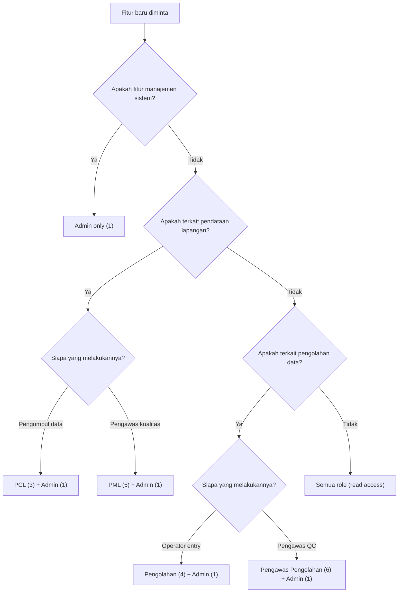

# Panduan AI Agent — MONIKA

> **Terakhir diperbarui**: 17 Februari 2026
>
> Dokumen ini diperuntukkan bagi AI coding assistant yang bekerja pada proyek MONIKA.

---

## 1. Konteks Proyek

**MONIKA** (Monitoring Nilai Kinerja & Anomali) adalah aplikasi web monitoring penerimaan dan pengolahan dokumen survei di BPS Kabupaten Jember.

| Aspek | Detail |
|-------|--------|
| Framework | CodeIgniter 4 |
| Frontend | AdminLTE 3 + Bootstrap 4 + jQuery |
| Database | MySQL/MariaDB |
| PHP Version | 8.2+ |
| Auth | Session-based, bcrypt password hashing |
| RBAC | Inline role checks via `session()->get('id_role')` |

---

## 2. Referensi Role

Saat diminta membuat atau memodifikasi fitur, **selalu pertimbangkan akses role**:

| id_role | Nama | Singkatan | Fungsi Utama |
|---------|------|-----------|-------------|
| 1 | Administrator | ADM | Full access, kelola user/kegiatan/laporan |
| 3 | Petugas Pendataan (PCL) | PCL | Setor dokumen, input tanda terima |
| 4 | Petugas Pengolahan | OLH | Entry/validasi dokumen, konfirmasi penerimaan |
| 5 | Pengawas Lapangan (PML) | PML | Uji petik, awasi PCL |
| 6 | Pengawas Pengolahan | PPG | Uji petik, awasi petugas pengolahan |

---

## 3. Decision Tree: Menentukan Role untuk Fitur Baru



**Prinsip utama**:
- Admin (1) **selalu** mendapat akses
- Fitur **input/submit** → role yang melakukan di lapangan/kantor
- Fitur **review/approve** → role supervisor atau pengolahan
- Fitur **lihat/monitor** → umumnya semua role

---

## 4. Pola Kode yang Harus Diikuti

### 4.1 Controller — Wajib menggunakan helper method

```php
// ✅ BENAR
private function canCreate(): bool
{
    return in_array((int) session()->get('id_role'), [1, 3]);
}

public function create()
{
    if (!$this->canCreate()) {
        return redirect()->to('/module')->with('error', 'Akses ditolak.');
    }
    // ...
}
```

### 4.2 View — Extend layout/template

```php
<?= $this->extend('layout/template'); ?>
<?= $this->section('content'); ?>
<!-- konten -->
<?= $this->endSection(); ?>
```

### 4.3 Route — Selalu gunakan CSRF filter pada POST

```php
$routes->post('store', 'Ctrl::store', ['filter' => 'csrf']);
```

### 4.4 Model — allowedFields eksplisit, timestamps

```php
protected $allowedFields = ['field1', 'field2'];
protected $useTimestamps = true;
```

---

## 5. Checklist Sebelum Menyelesaikan Fitur

Gunakan checklist ini setiap kali membuat atau memodifikasi fitur:

- [ ] **Role check** di setiap method controller yang sensitif
- [ ] **CSRF** di setiap route POST
- [ ] **View** menggunakan `layout/template`
- [ ] **Escape output** dengan `esc()` di view
- [ ] **Route** terdaftar di `Routes.php`
- [ ] **Sidebar** — tambahkan menu jika fitur memerlukan halaman baru
- [ ] **PHP syntax check** — `php -l` pada semua file baru/modifikasi
- [ ] **Dokumentasi** — update `docs/` jika ada perubahan role/permission

---

## 6. Testing Multi-Role

### 6.1 Akun Testing

Password semua akun dummy: `Monika@2026!`

| Role | Username | Gunakan untuk |
|------|----------|--------------|
| Admin | `admin_01` | Test full access |
| PCL | `pcl_01` | Test submit/setor |
| Pengolahan | `pengolah_01` | Test entry/konfirmasi |
| PML | `pml_01` | Test monitoring/uji petik |
| Pengawas | `pengawas_01` | Test QC/oversight |

### 6.2 Skenario Test Wajib

Untuk setiap fitur baru, test skenario berikut:

1. **Happy path** — Login sebagai role yang berhak, gunakan fitur
2. **Unauthorized access** — Login sebagai role yang TIDAK berhak, pastikan redirect/ditolak
3. **Direct URL access** — Akses URL endpoint langsung tanpa melalui menu
4. **Edge case** — Input data kosong, data duplikat, data ekstrem
5. **CSRF** — Pastikan form submission gagal tanpa CSRF token

### 6.3 Contoh Test Script (Manual)

```
1. Login sebagai pcl_01 (role 3)
2. Akses /penyetoran/create → ✅ Harus berhasil
3. Akses /users → ❌ Harus redirect/ditolak
4. Akses /laporan → ❌ Harus redirect/ditolak
5. Submit form penyetoran → ✅ Data tersimpan
6. Logout, login sebagai pengolah_01 (role 4)  
7. Akses /penyetoran/detail/1 → ✅ Harus muncul tombol Terima/Tolak
8. Klik Terima → ✅ Status berubah
```

---

## 7. Konteks Khusus untuk Prompt

### 7.1 Saat diminta membuat fitur baru

> Respons yang diharapkan: "Fitur ini akan dibuat dengan akses untuk role [X, Y]. Berikut alasannya: [penjelasan]. Apakah role akses ini sudah sesuai?"

### 7.2 Saat diminta memodifikasi permission

> Langkah: (1) Cari semua controller/view yang terpengaruh, (2) Ubah inline check, (3) Update sidebar, (4) Update docs, (5) Test semua role

### 7.3 Saat diminta membuat laporan/dashboard

> Default: Admin only. Tanyakan apakah role lain perlu melihat data agregat atau hanya data mereka sendiri.

### 7.4 File kunci yang perlu diperiksa

| File | Alasan |
|------|--------|
| `app/Config/Routes.php` | Semua endpoint terdaftar di sini |
| `app/Views/layout/sidebar.php` | Menu visibility berdasarkan role |
| `app/Filters/AuthFilter.php` | Auth middleware |
| `docs/ROLES.md` | Referensi permission matrix |
| `docs/STANDAR_KONVENSI.md` | Coding standards |
