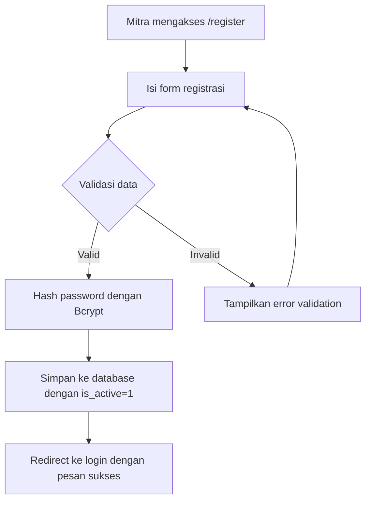
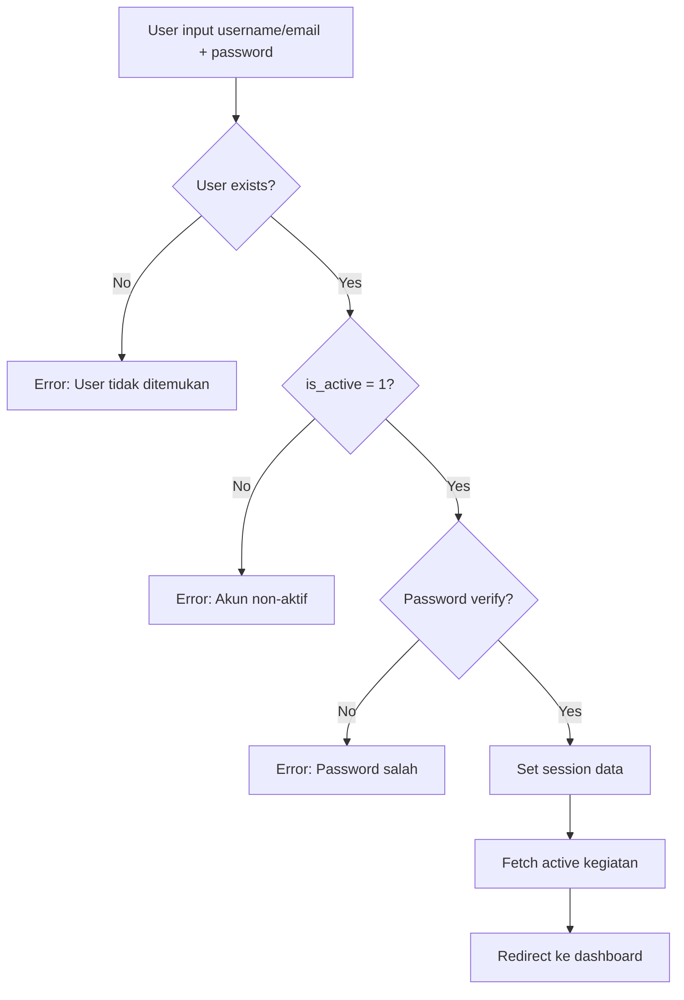
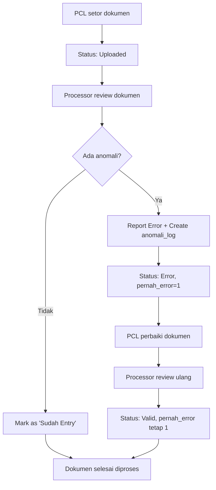
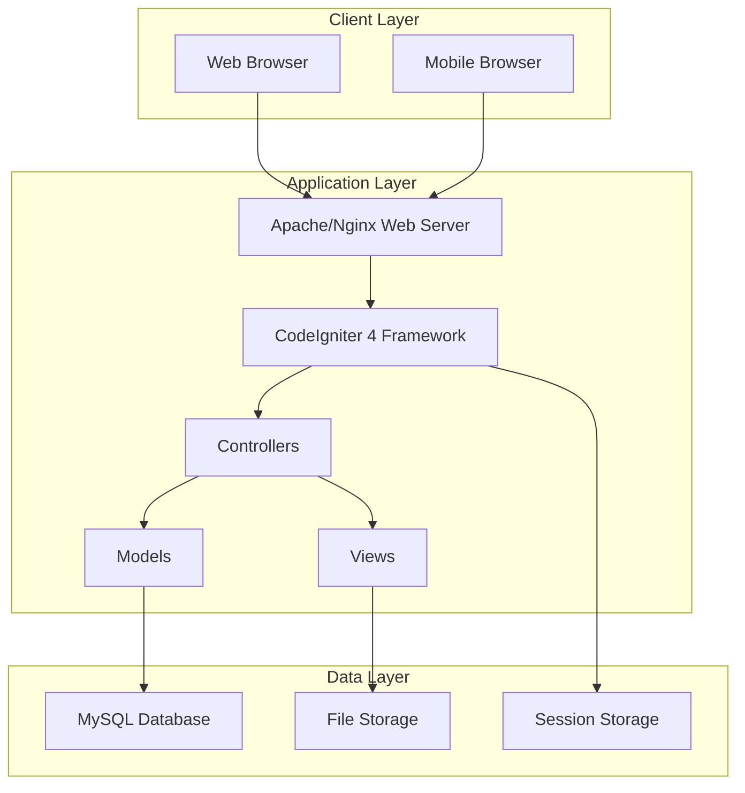
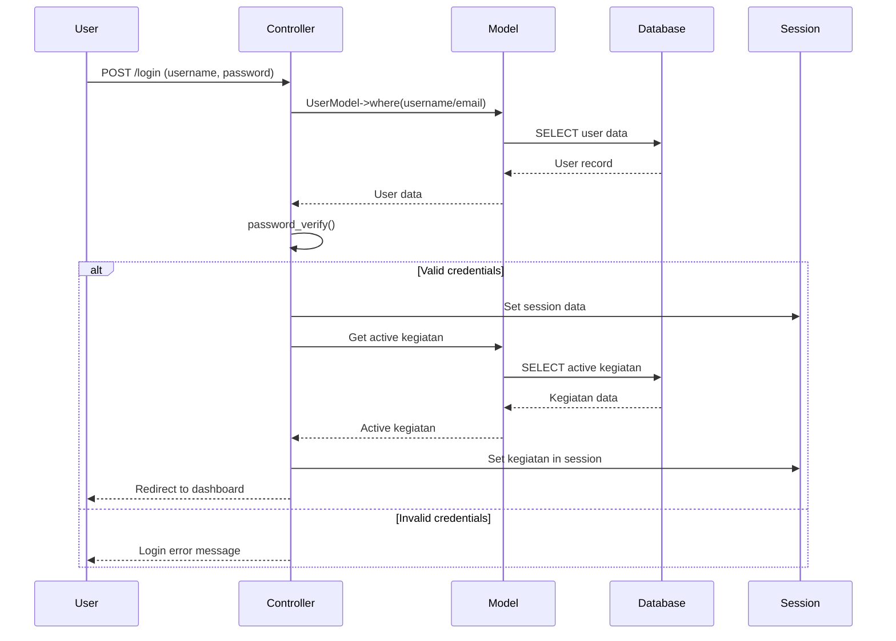
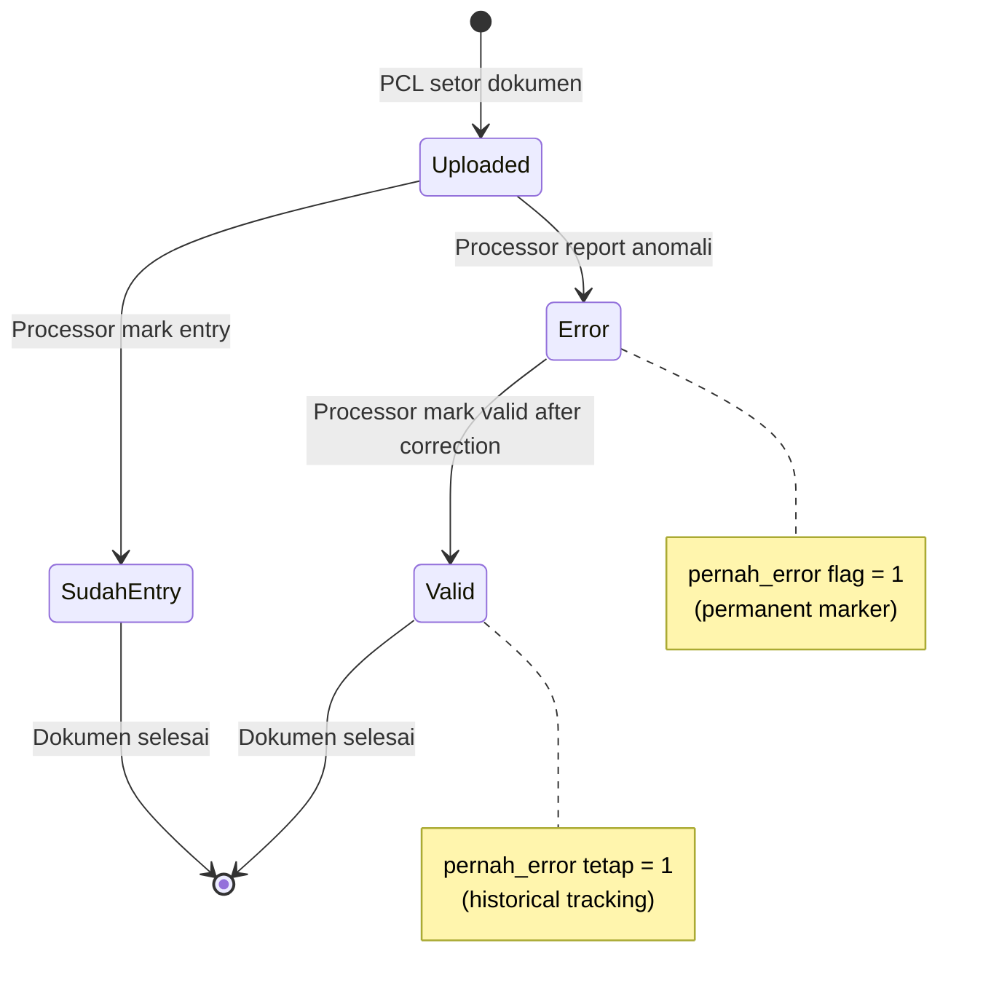
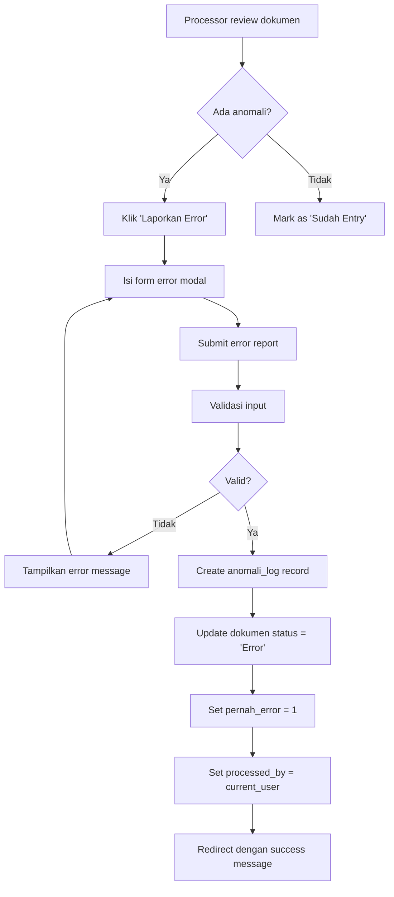

# DOKUMENTASI KOMPREHENSIF APLIKASI MONIKA

**MONIKA (Monitoring Nilai Kinerja & Anomali)**  
Sistem Monitoring Kualitas Data Survei Statistik

---

## 📋 DAFTAR ISI

1. [Ringkasan Eksekutif](#ringkasan-eksekutif)
2. [Arsitektur Sistem](#arsitektur-sistem)
3. [Analisis Database](#analisis-database)
4. [Analisis Backend](#analisis-backend)
5. [Analisis Frontend](#analisis-frontend)
6. [Logika Proses Bisnis](#logika-proses-bisnis)
7. [Struktur File & Folder](#struktur-file--folder)
8. [Alur Sistem & Flowchart](#alur-sistem--flowchart)
9. [Panduan Debugging](#panduan-debugging)
10. [Pengembangan & Maintenance](#pengembangan--maintenance)

---

## 🎯 RINGKASAN EKSEKUTIF

### Tujuan Aplikasi
MONIKA adalah sistem web berbasis CodeIgniter 4 yang dirancang untuk mendigitalisasi proses pemantauan kualitas data survei statistik. Sistem ini berfokus pada pelacakan anomali (error) pada dokumen survei dan mengevaluasi kinerja seluruh aktor yang terlibat secara objektif berbasis data.

### Fitur Utama
- **Manajemen Dokumen Survei**: Upload, tracking, dan validasi dokumen
- **Sistem Pelaporan Anomali**: Pencatatan dan pelacakan error
- **Evaluasi Kinerja Multi-Role**: PCL, Processor, dan Supervisor
- **Dashboard Monitoring Real-time**: Statistik dan ranking performa
- **Manajemen Kegiatan Survei**: Pemisahan data per periode survei

### Target Pengguna
- **Administrator**: Pengelola sistem utama
- **Petugas Pendataan (PCL)**: Mitra lapangan
- **Petugas Pengolahan**: Mitra entry/editing data
- **Pengawas Lapangan (PML)**: Supervisor PCL
- **Pengawas Pengolahan**: Supervisor tim pengolahan

---

## 🏗️ ARSITEKTUR SISTEM

### Stack Teknologi
```
Frontend:  HTML5, CSS3, Bootstrap (AdminLTE 3.2)
Backend:   PHP 8.1+, CodeIgniter 4
Database:  MySQL 8.0+ / MariaDB
Session:   CodeIgniter Session Handler
Security:  Bcrypt Password Hashing, RBAC
```

### Pola Arsitektur
- **MVC Pattern**: Model-View-Controller
- **RBAC**: Role-Based Access Control
- **Session-based Authentication**
- **RESTful Routes dengan Route Groups**

### Komponen Utama
```
app/
├── Controllers/     # Request handlers & business logic
├── Models/         # Data access layer & business rules
├── Views/          # Presentation layer (UI templates)
├── Filters/        # Authentication & authorization
├── Config/         # Application configuration
└── Database/       # Migrations & seeds
```

---

## 🗄️ ANALISIS DATABASE

### Schema Overview
Database MONIKA terdiri dari 5 tabel utama dengan relasi yang terstruktur:

```sql
roles (1) ←→ (M) users (1) ←→ (M) dokumen_survei (M) ←→ (1) master_kegiatan
                                        ↓
                                 anomali_log (M)
```

### Tabel Utama

#### 1. `roles` - Definisi Peran
```sql
CREATE TABLE roles (
    id_role INT PRIMARY KEY AUTO_INCREMENT,
    role_name VARCHAR(50) NOT NULL,
    description TEXT
);
```
**Data Seed:**
- 1: Administrator (Super user)
- 3: Petugas Pendataan (PCL)
- 4: Petugas Pengolahan
- 5: Pengawas Lapangan (PML)
- 6: Pengawas Pengolahan

#### 2. `users` - Data Pengguna
```sql
CREATE TABLE users (
    id_user INT PRIMARY KEY AUTO_INCREMENT,
    fullname VARCHAR(100) NOT NULL,
    username VARCHAR(50) UNIQUE NOT NULL,
    email VARCHAR(100) UNIQUE NOT NULL,
    password VARCHAR(255) NOT NULL,  -- Bcrypt hashed
    nik_ktp VARCHAR(16),             -- 16-digit ID
    sobat_id VARCHAR(50),            -- Partner ID
    id_role INT NOT NULL,            -- FK to roles
    id_supervisor INT,               -- Self-referencing FK
    is_active TINYINT(1) DEFAULT 1,
    created_at TIMESTAMP DEFAULT CURRENT_TIMESTAMP,
    updated_at TIMESTAMP DEFAULT CURRENT_TIMESTAMP ON UPDATE CURRENT_TIMESTAMP
);
```

#### 3. `master_kegiatan` - Periode Survei
```sql
CREATE TABLE master_kegiatan (
    id_kegiatan INT PRIMARY KEY AUTO_INCREMENT,
    nama_kegiatan VARCHAR(100) NOT NULL,
    kode_kegiatan VARCHAR(20) UNIQUE NOT NULL,
    tanggal_mulai DATE NOT NULL,
    tanggal_selesai DATE NOT NULL,
    status ENUM('Aktif', 'Selesai') DEFAULT 'Aktif',
    created_at TIMESTAMP DEFAULT CURRENT_TIMESTAMP
);
```

#### 4. `dokumen_survei` - Transaksi Dokumen
```sql
CREATE TABLE dokumen_survei (
    id_dokumen INT PRIMARY KEY AUTO_INCREMENT,
    id_kegiatan INT NOT NULL,                    -- FK to master_kegiatan
    kode_wilayah VARCHAR(20) NOT NULL,
    id_petugas_pendataan INT,                    -- FK to users (Role 3)
    processed_by INT,                            -- FK to users (Role 4)
    status ENUM('Uploaded', 'Sudah Entry', 'Error', 'Valid') DEFAULT 'Uploaded',
    pernah_error TINYINT(1) DEFAULT 0,          -- Permanent error flag
    tanggal_setor DATE,
    created_at TIMESTAMP DEFAULT CURRENT_TIMESTAMP,
    updated_at TIMESTAMP DEFAULT CURRENT_TIMESTAMP ON UPDATE CURRENT_TIMESTAMP
);
```

#### 5. `anomali_log` - Audit Trail Error
```sql
CREATE TABLE anomali_log (
    id_anomali INT PRIMARY KEY AUTO_INCREMENT,
    id_dokumen INT NOT NULL,                     -- FK to dokumen_survei
    id_petugas_pengolahan INT,                   -- FK to users (Role 4)
    jenis_error VARCHAR(100) NOT NULL,
    keterangan TEXT,
    created_at TIMESTAMP DEFAULT CURRENT_TIMESTAMP
);
```

### Relasi & Constraints
- **CASCADE DELETE**: master_kegiatan → dokumen_survei → anomali_log
- **SET NULL**: users (supervisor/processor) deletion
- **UNIQUE**: username, email, kode_kegiatan
- **INDEXES**: id_role, id_supervisor, id_kegiatan, foreign keys

---

## ⚙️ ANALISIS BACKEND

### Models Layer

#### UserModel (`app/Models/UserModel.php`)
**Tanggung Jawab**: Manajemen data pengguna & autentikasi
```php
class UserModel extends Model {
    protected $table = 'users';
    protected $primaryKey = 'id_user';
    protected $allowedFields = [
        'fullname', 'username', 'email', 'password', 
        'nik_ktp', 'sobat_id', 'id_role', 'id_supervisor', 'is_active'
    ];
    
    // Auto-hash password sebelum insert/update
    protected $beforeInsert = ['hashPassword'];
    protected $beforeUpdate = ['hashPassword'];
}
```

#### DokumenModel (`app/Models/DokumenModel.php`)
**Tanggung Jawab**: Lifecycle dokumen & analytics performa
```php
class DokumenModel extends Model {
    // Mengambil dokumen dengan relasi (JOIN)
    public function getDokumenWithRelations($role_id, $user_id);
    
    // Menghitung performa PCL (quality metrics)
    public function getPclPerformance($id_kegiatan = null);
    
    // Menghitung performa Processor (productivity)
    public function getProcessorPerformance($id_kegiatan = null);
}
```

#### KegiatanModel (`app/Models/KegiatanModel.php`)
**Tanggung Jawab**: Master data kegiatan survei
```php
class KegiatanModel extends Model {
    protected $validationRules = [
        'nama_kegiatan' => 'required|min_length(3)|max_length(100)',
        'kode_kegiatan' => 'required|min_length(3)|max_length(20)|is_unique[...]',
        'tanggal_mulai' => 'required|valid_date',
        'tanggal_selesai' => 'required|valid_date'
    ];
}
```

#### AnomaliModel (`app/Models/AnomaliModel.php`)
**Tanggung Jawab**: Audit trail error (immutable records)
```php
class AnomaliModel extends Model {
    protected $table = 'anomali_log';
    protected $useTimestamps = true;
    protected $createdField = 'created_at';
    protected $updatedField = ''; // No updates allowed
}
```

### Controllers Layer

#### Auth Controller (`app/Controllers/Auth.php`)
**Endpoints & Fungsi:**
- `GET /login` → Tampilkan form login
- `POST /login` → Proses autentikasi
- `GET /register` → Form registrasi mitra
- `POST /register` → Proses registrasi
- `GET /logout` → Destroy session

**Business Logic:**
```php
// Login process
public function loginProcess() {
    // 1. Validasi username/email + password
    // 2. Cek status is_active
    // 3. Verify password dengan Bcrypt
    // 4. Set session data + active kegiatan
    // 5. Redirect ke dashboard
}
```

#### Home Controller (`app/Controllers/Home.php`)
**Dashboard Utama:**
```php
public function index() {
    // Real-time statistics
    $data = [
        'stat_total' => $totalDocs->countAllResults(),
        'stat_error' => $totalError->where('status', 'Error')->countAllResults(),
        'stat_entry' => $totalEntry->where('status', 'Sudah Entry')->countAllResults(),
        'ranking' => $rankingBuilder->get()->getResultArray() // Top 5 error contributors
    ];
}
```

#### Dokumen Controller (`app/Controllers/Dokumen.php`)
**Document Lifecycle Management:**
```php
// Setor dokumen (PCL only)
public function store() {
    $data = [
        'id_kegiatan' => $this->request->getPost('id_kegiatan'),
        'kode_wilayah' => $this->request->getPost('kode_wilayah'),
        'id_petugas_pendataan' => session()->get('id_user'), // Auto-assign
        'status' => 'Uploaded'
    ];
}

// Lapor anomali (Processor only)
public function reportError() {
    // 1. Create anomali_log entry
    // 2. Update document status to 'Error'
    // 3. Set pernah_error flag to 1
}
```

### Authentication & Authorization

#### AuthFilter (`app/Filters/AuthFilter.php`)
```php
public function before(RequestInterface $request, $arguments = null) {
    if (!session()->get('is_logged_in')) {
        return redirect()->to('/login');
    }
}
```

#### Role-Based Access Control
```php
// Example: Admin-only access
if (session()->get('id_role') != 1) {
    return redirect()->to('/dashboard')->with('error', 'Akses ditolak.');
}

// Example: Multi-role access
if (!in_array(session()->get('id_role'), [1, 3])) {
    return redirect()->to('/dokumen')->with('error', 'Akses ditolak.');
}
```

### Routing Configuration (`app/Config/Routes.php`)
```php
// Public routes
$routes->get('/login', 'Auth::login');
$routes->post('/login', 'Auth::loginProcess');

// Protected routes (require 'auth' filter)
$routes->get('/dashboard', 'Home::index', ['filter' => 'auth']);

// Route groups
$routes->group('dokumen', ['filter' => 'auth'], function($routes) {
    $routes->get('/', 'Dokumen::index');
    $routes->post('store', 'Dokumen::store');
    $routes->post('mark-entry/(:num)', 'Dokumen::markEntry/$1');
});
```

---

## 🎨 ANALISIS FRONTEND

### UI Framework & Struktur
- **AdminLTE 3.2**: Bootstrap-based admin template
- **Responsive Design**: Mobile-friendly interface
- **DataTables**: Interactive data tables
- **Modal Dialogs**: Form interactions
- **Real-time Widgets**: Dashboard statistics

### View Organization
```
app/Views/
├── auth/
│   ├── login.php           # Form login
│   └── register.php        # Form registrasi mitra
├── dashboard/
│   └── index.php           # Dashboard utama dengan statistik
├── dokumen/
│   ├── index.php           # List dokumen (role-filtered)
│   ├── create.php          # Form setor dokumen
│   └── modal_error.php     # Modal lapor anomali
├── kegiatan/
│   ├── index.php           # Management kegiatan (Admin only)
│   └── modal_create.php    # Modal create kegiatan
├── monitoring/
│   └── dashboard.php       # Dashboard monitoring komprehensif
└── laporan/
    ├── pcl.php             # Laporan performa PCL
    └── pengolahan.php      # Laporan performa Processor
```

### Komponen UI Utama

#### Dashboard Widgets
```html
<!-- Statistics Cards -->
<div class="row">
    <div class="col-lg-3 col-6">
        <div class="small-box bg-info">
            <div class="inner">
                <h3><?= $stat_total ?></h3>
                <p>Total Dokumen</p>
            </div>
        </div>
    </div>
    <!-- More widgets... -->
</div>
```

#### DataTables Implementation
```javascript
$('#dokumenTable').DataTable({
    responsive: true,
    lengthChange: false,
    autoWidth: false,
    language: {
        url: '//cdn.datatables.net/plug-ins/1.10.24/i18n/Indonesian.json'
    }
});
```

#### Modal Forms
```html
<!-- Error Reporting Modal -->
<div class="modal fade" id="errorModal">
    <div class="modal-dialog">
        <form action="/dokumen/report-error" method="POST">
            <div class="modal-content">
                <div class="modal-header">
                    <h4>Laporkan Anomali</h4>
                </div>
                <div class="modal-body">
                    <input type="hidden" name="id_dokumen" id="error_id_dokumen">
                    <div class="form-group">
                        <label>Jenis Error</label>
                        <select name="jenis_error" class="form-control" required>
                            <option value="">Pilih Jenis Error</option>
                            <option value="Data Tidak Lengkap">Data Tidak Lengkap</option>
                            <option value="Format Salah">Format Salah</option>
                            <option value="Inkonsistensi Data">Inkonsistensi Data</option>
                        </select>
                    </div>
                    <div class="form-group">
                        <label>Keterangan Detail</label>
                        <textarea name="keterangan" class="form-control" rows="3" required></textarea>
                    </div>
                </div>
                <div class="modal-footer">
                    <button type="submit" class="btn btn-danger">Laporkan Error</button>
                </div>
            </div>
        </form>
    </div>
</div>
```

### State Management
- **Session-based**: User state disimpan di server session
- **Flash Messages**: Notifikasi sukses/error menggunakan CodeIgniter flash data
- **Form Validation**: Server-side validation dengan error display

---

## 📊 LOGIKA PROSES BISNIS

### 1. Alur Registrasi & Autentikasi

#### Registrasi Mitra


#### Proses Login


### 2. Lifecycle Dokumen Survei

#### Status Flow Dokumen
```
Uploaded → Sudah Entry → Error → Valid
    ↓           ↓         ↓       ↓
  (PCL)    (Processor) (Processor) (Processor)
```

#### Detailed Document Flow


### 3. Evaluasi Kinerja Multi-Role

#### PCL Performance Metrics
```sql
-- Quality Score Calculation
SELECT 
    users.fullname,
    COUNT(dokumen_survei.id_dokumen) as total_dokumen,
    SUM(CASE WHEN dokumen_survei.pernah_error = 1 THEN 1 ELSE 0 END) as total_error,
    (SUM(CASE WHEN dokumen_survei.pernah_error = 1 THEN 1 ELSE 0 END) / 
     COUNT(dokumen_survei.id_dokumen) * 100) as error_rate_percent
FROM users 
LEFT JOIN dokumen_survei ON users.id_user = dokumen_survei.id_petugas_pendataan
WHERE users.id_role = 3  -- PCL
GROUP BY users.id_user
ORDER BY error_rate_percent ASC;  -- Lower is better
```

#### Processor Performance Metrics
```sql
-- Productivity Score Calculation
SELECT 
    users.fullname,
    COUNT(dokumen_survei.id_dokumen) as total_entry,
    COUNT(anomali_log.id_anomali) as total_temuan_error
FROM users 
LEFT JOIN dokumen_survei ON users.id_user = dokumen_survei.processed_by
LEFT JOIN anomali_log ON users.id_user = anomali_log.id_petugas_pengolahan
WHERE users.id_role = 4  -- Processor
GROUP BY users.id_user
ORDER BY total_entry DESC;  -- Higher is better
```

#### Supervisor Team Aggregation
```sql
-- Team Performance Calculation
SELECT 
    spv.fullname as supervisor_name,
    COUNT(DISTINCT pcl.id_user) as team_size,
    COUNT(doc.id_dokumen) as total_team_docs,
    SUM(CASE WHEN doc.pernah_error = 1 THEN 1 ELSE 0 END) as total_team_errors,
    (SUM(CASE WHEN doc.pernah_error = 1 THEN 1 ELSE 0 END) / 
     COUNT(doc.id_dokumen) * 100) as team_error_rate
FROM users spv
LEFT JOIN users pcl ON pcl.id_supervisor = spv.id_user
LEFT JOIN dokumen_survei doc ON doc.id_petugas_pendataan = pcl.id_user
WHERE spv.id_role = 5  -- PML (Supervisor)
GROUP BY spv.id_user
ORDER BY team_error_rate ASC;
```

### 4. Business Rules & Validations

#### Data Integrity Rules
1. **Kegiatan Aktif**: Setiap dokumen WAJIB dikaitkan dengan kegiatan yang statusnya 'Aktif'
2. **Role Restrictions**: 
   - PCL (Role 3) hanya bisa setor dokumen
   - Processor (Role 4) bisa mark entry dan report error
   - Admin (Role 1) akses penuh
3. **Permanent Error Flag**: Field `pernah_error` tidak pernah direset ke 0 setelah diset ke 1
4. **Cascade Delete**: Hapus kegiatan akan menghapus semua dokumen terkait

#### Validation Logic
```php
// Dokumen validation rules
protected $validationRules = [
    'id_kegiatan' => 'required|integer',
    'kode_wilayah' => 'required|min_length(3)|max_length(20)',
    'id_petugas_pendataan' => 'required|integer',
    'tanggal_setor' => 'required|valid_date'
];

// Kegiatan validation rules
protected $validationRules = [
    'nama_kegiatan' => 'required|min_length(3)|max_length(100)',
    'kode_kegiatan' => 'required|min_length(3)|max_length(20)|is_unique[master_kegiatan.kode_kegiatan]',
    'tanggal_mulai' => 'required|valid_date',
    'tanggal_selesai' => 'required|valid_date'
];
```

---

## 📁 STRUKTUR FILE & FOLDER

### Project Root Structure
```
monika/
├── app/                    # Application core
│   ├── Config/            # Configuration files
│   ├── Controllers/       # Request handlers
│   ├── Database/          # Migrations & seeds
│   ├── Filters/           # Authentication filters
│   ├── Models/            # Data access layer
│   └── Views/             # UI templates
├── public/                # Web root
│   ├── index.php          # Entry point
│   └── assets/            # CSS, JS, images
├── writable/              # Logs, cache, sessions
├── vendor/                # Composer dependencies
├── .env                   # Environment configuration
├── composer.json          # PHP dependencies
└── monika_schema.sql      # Database schema
```

### Detailed App Structure
```
app/
├── Config/
│   ├── App.php            # Application settings
│   ├── Database.php       # Database configuration
│   ├── Routes.php         # URL routing
│   ├── Filters.php        # Filter configuration
│   └── Services.php       # Service definitions
├── Controllers/
│   ├── BaseController.php # Base controller class
│   ├── Auth.php           # Authentication controller
│   ├── Home.php           # Dashboard controller
│   ├── Dokumen.php        # Document management
│   ├── Kegiatan.php       # Activity management
│   ├── Monitoring.php     # Monitoring dashboard
│   └── Laporan.php        # Reporting controller
├── Models/
│   ├── UserModel.php      # User data model
│   ├── DokumenModel.php   # Document model
│   ├── KegiatanModel.php  # Activity model
│   ├── AnomaliModel.php   # Anomaly model
│   └── RoleModel.php      # Role model
├── Views/
│   ├── auth/              # Authentication views
│   ├── dashboard/         # Dashboard views
│   ├── dokumen/           # Document views
│   ├── kegiatan/          # Activity views
│   ├── monitoring/        # Monitoring views
│   └── laporan/           # Report views
├── Filters/
│   └── AuthFilter.php     # Authentication filter
└── Database/
    ├── Migrations/        # Database migrations
    └── Seeds/             # Database seeders
```

### Configuration Files Analysis

#### Database Configuration (`app/Config/Database.php`)
```php
public array $default = [
    'DSN'      => '',
    'hostname' => 'localhost',
    'username' => 'root',
    'password' => '',
    'database' => 'monika',
    'DBDriver' => 'MySQLi',
    'DBPrefix' => '',
    'pConnect' => false,
    'DBDebug'  => true,
    'charset'  => 'utf8mb4',
    'DBCollat' => 'utf8mb4_general_ci',
];
```

#### Routes Configuration (`app/Config/Routes.php`)
```php
// Route groups dengan filter auth
$routes->group('dokumen', ['filter' => 'auth'], function($routes) {
    $routes->get('/', 'Dokumen::index');
    $routes->get('create', 'Dokumen::create');
    $routes->post('store', 'Dokumen::store');
});
```

### Asset Management
```
public/
├── css/
│   ├── adminlte.min.css   # AdminLTE framework
│   └── custom.css         # Custom styles
├── js/
│   ├── adminlte.min.js    # AdminLTE scripts
│   ├── jquery.min.js      # jQuery library
│   └── app.js             # Application scripts
└── img/
    ├── logo.png           # Application logo
    └── avatars/           # User avatars
```

---

## 🔄 ALUR SISTEM & FLOWCHART

### 1. System Architecture Diagram



### 2. User Authentication Flow



### 3. Document Lifecycle Flow



### 4. Performance Evaluation Flow

```mermaid
graph TD
    A[Admin akses Monitoring] --> B[Pilih filter kegiatan]
    B --> C[Query database untuk statistik]
    C --> D[Hitung performa PCL]
    C --> E[Hitung performa Processor]
    C --> F[Hitung performa Supervisor]
    
    D --> G[Error rate = total_error / total_dokumen]
    E --> H[Productivity = total_entry]
    F --> I[Team aggregate = avg(team_performance)]
    
    G --> J[Ranking PCL by quality]
    H --> K[Ranking Processor by productivity]
    I --> L[Ranking Supervisor by team performance]
    
    J --> M[Display dashboard]
    K --> M
    L --> M
```

### 5. Data Flow Diagram (Level 0)

```mermaid
graph TD
    subgraph "External Entities"
        PCL[Petugas Pendataan]
        PROC[Petugas Pengolahan]
        ADMIN[Administrator]
        PML[Pengawas]
    end
    
    subgraph "MONIKA System"
        AUTH[Authentication]
        DOC[Document Management]
        MON[Monitoring & Analytics]
        MASTER[Master Data Management]
    end
    
    subgraph "Data Stores"
        DB[(Database)]
        SESS[(Session)]
    end
    
    PCL --> AUTH : Login credentials
    PCL --> DOC : Submit documents
    PROC --> DOC : Process documents
    PROC --> DOC : Report anomalies
    ADMIN --> MASTER : Manage kegiatan
    ADMIN --> MON : View reports
    PML --> MON : Monitor team
    
    AUTH --> SESS : Session data
    DOC --> DB : Document data
    MON --> DB : Query analytics
    MASTER --> DB : Master data
```

### 6. Error Handling Flow



---

## 🐛 PANDUAN DEBUGGING

### 1. Common Issues & Solutions

#### Authentication Issues
```php
// Debug session data
var_dump(session()->get());

// Check if user is logged in
if (!session()->get('is_logged_in')) {
    log_message('debug', 'User not logged in, redirecting to login');
}

// Verify password hashing
$password = 'test123';
$hash = password_hash($password, PASSWORD_BCRYPT);
$verify = password_verify($password, $hash);
echo $verify ? 'Valid' : 'Invalid';
```

#### Database Connection Issues
```php
// Test database connection
$db = \Config\Database::connect();
if ($db->connID) {
    echo "Database connected successfully";
} else {
    echo "Database connection failed: " . $db->error();
}

// Enable query debugging
$db->query("SELECT * FROM users", false, true);
echo $db->getLastQuery();
```

#### Model Validation Errors
```php
// Check validation errors
$userModel = new UserModel();
$data = [...];
if (!$userModel->save($data)) {
    var_dump($userModel->errors());
}

// Custom validation
$validation = \Config\Services::validation();
$validation->setRules([
    'email' => 'required|valid_email|is_unique[users.email]'
]);
if (!$validation->run($data)) {
    var_dump($validation->getErrors());
}
```

### 2. Logging & Monitoring

#### Enable Debug Mode
```php
// .env file
CI_ENVIRONMENT = development

// app/Config/Logger.php
public array $threshold = [
    'production'  => 4,  // ERROR and above
    'development' => 0,  // ALL levels
];
```

#### Custom Logging
```php
// Log user actions
log_message('info', 'User ' . session()->get('username') . ' accessed dashboard');

// Log errors
log_message('error', 'Failed to save document: ' . $e->getMessage());

// Log debug information
log_message('debug', 'Query executed: ' . $db->getLastQuery());
```

### 3. Performance Debugging

#### Query Performance
```php
// Enable query profiling
$db = \Config\Database::connect();
$db->query("SELECT * FROM dokumen_survei WHERE id_kegiatan = ?", [$id]);
echo "Execution time: " . $db->getQueryTime();

// Analyze slow queries
$builder = $db->table('dokumen_survei');
$builder->select('*');
$builder->join('users', 'users.id_user = dokumen_survei.id_petugas_pendataan');
$builder->where('dokumen_survei.status', 'Error');
echo $builder->getCompiledSelect(); // Show SQL without executing
```

#### Memory Usage
```php
// Monitor memory usage
echo "Memory usage: " . memory_get_usage(true) / 1024 / 1024 . " MB\n";
echo "Peak memory: " . memory_get_peak_usage(true) / 1024 / 1024 . " MB\n";
```

### 4. Error Tracking Checklist

#### User Registration Issues
- [ ] Check unique constraints (username, email)
- [ ] Verify password hashing callback
- [ ] Validate NIK format (16 digits)
- [ ] Check role ID validity (3 or 4 only)

#### Document Processing Issues
- [ ] Verify kegiatan is active
- [ ] Check user role permissions
- [ ] Validate foreign key relationships
- [ ] Ensure proper status transitions

#### Performance Issues
- [ ] Check database indexes
- [ ] Analyze query execution plans
- [ ] Monitor session storage size
- [ ] Review JOIN query efficiency

---

## 🚀 PENGEMBANGAN & MAINTENANCE

### 1. Development Workflow

#### Local Development Setup
```bash
# Clone repository
git clone <repository-url>
cd monika

# Install dependencies
composer install

# Setup environment
cp env .env
# Edit .env with local database credentials

# Import database
mysql -u root -p monika < monika_schema.sql

# Start development server
php spark serve
```

#### Code Standards
```php
// Follow PSR-12 coding standards
class ExampleController extends BaseController
{
    public function methodName(): ResponseInterface
    {
        // Method implementation
    }
}

// Use type hints
public function getUserById(int $userId): ?array
{
    return $this->userModel->find($userId);
}

// Document methods
/**
 * Calculate PCL performance metrics
 * 
 * @param int|null $idKegiatan Filter by kegiatan ID
 * @return array Performance data
 */
public function getPclPerformance(?int $idKegiatan = null): array
{
    // Implementation
}
```

### 2. Database Migrations

#### Creating Migrations
```bash
# Create new migration
php spark make:migration AddColumnToTable

# Run migrations
php spark migrate

# Rollback migrations
php spark migrate:rollback
```

#### Example Migration
```php
<?php
namespace App\Database\Migrations;
use CodeIgniter\Database\Migration;

class AddColumnToTable extends Migration
{
    public function up()
    {
        $this->forge->addColumn('dokumen_survei', [
            'new_column' => [
                'type' => 'VARCHAR',
                'constraint' => 100,
                'null' => true,
                'after' => 'existing_column'
            ]
        ]);
    }

    public function down()
    {
        $this->forge->dropColumn('dokumen_survei', 'new_column');
    }
}
```

### 3. Testing Strategy

#### Unit Testing
```php
<?php
namespace App\Tests\Unit;
use CodeIgniter\Test\CIUnitTestCase;

class UserModelTest extends CIUnitTestCase
{
    public function testPasswordHashing()
    {
        $userModel = new \App\Models\UserModel();
        $data = ['password' => 'test123'];
        $result = $userModel->hashPassword(['data' => $data]);
        
        $this->assertTrue(password_verify('test123', $result['data']['password']));
    }
}
```

#### Integration Testing
```php
<?php
namespace App\Tests\Feature;
use CodeIgniter\Test\FeatureTestCase;

class AuthTest extends FeatureTestCase
{
    public function testLoginSuccess()
    {
        $result = $this->post('/login', [
            'login_id' => 'admin',
            'password' => 'password123'
        ]);
        
        $result->assertRedirectTo('/dashboard');
        $this->assertTrue(session()->get('is_logged_in'));
    }
}
```

### 4. Deployment Guide

#### Production Checklist
- [ ] Set CI_ENVIRONMENT = production
- [ ] Configure production database
- [ ] Set secure session configuration
- [ ] Enable HTTPS
- [ ] Configure proper file permissions
- [ ] Setup backup procedures
- [ ] Configure monitoring & logging

#### Server Configuration
```apache
# .htaccess for Apache
RewriteEngine On
RewriteCond %{REQUEST_FILENAME} !-f
RewriteCond %{REQUEST_FILENAME} !-d
RewriteRule ^(.*)$ index.php/$1 [L]

# Security headers
Header always set X-Content-Type-Options nosniff
Header always set X-Frame-Options DENY
Header always set X-XSS-Protection "1; mode=block"
```

### 5. Monitoring & Maintenance

#### Performance Monitoring
```php
// Monitor query performance
$db = \Config\Database::connect();
$queries = $db->getQueries();
foreach ($queries as $query) {
    if ($query['time'] > 1.0) { // Slow query threshold
        log_message('warning', 'Slow query detected: ' . $query['sql']);
    }
}
```

#### Backup Procedures
```bash
# Database backup
mysqldump -u username -p monika > backup_$(date +%Y%m%d_%H%M%S).sql

# File backup
tar -czf files_backup_$(date +%Y%m%d_%H%M%S).tar.gz writable/ public/uploads/
```

#### Log Rotation
```bash
# Setup logrotate for application logs
/path/to/writable/logs/*.log {
    daily
    rotate 30
    compress
    delaycompress
    missingok
    notifempty
}
```

---

## 📚 REFERENSI & RESOURCES

### Framework Documentation
- [CodeIgniter 4 User Guide](https://codeigniter.com/user_guide/)
- [AdminLTE Documentation](https://adminlte.io/docs/)
- [Bootstrap Documentation](https://getbootstrap.com/docs/)

### Database Resources
- [MySQL Documentation](https://dev.mysql.com/doc/)
- [Database Design Best Practices](https://www.vertabelo.com/blog/database-design-best-practices/)

### Security Guidelines
- [OWASP Top 10](https://owasp.org/www-project-top-ten/)
- [PHP Security Best Practices](https://www.php.net/manual/en/security.php)

---

**Dokumen ini dibuat pada:** <?= date('d F Y H:i:s') ?>  
**Versi:** 1.0  
**Status:** Lengkap dan siap digunakan