# Dokumentasi Role & Hak Akses — MONIKA

> **Terakhir diperbarui**: 17 Februari 2026

## 1. Daftar Role

| id_role | Nama Role | Kode Singkat | Deskripsi |
|---------|-----------|-------------|-----------|
| 1 | **Administrator** | ADM | Super user dengan akses penuh ke seluruh modul |
| 3 | **Petugas Pendataan (PCL)** | PCL | Mitra lapangan yang melakukan pendataan di wilayah kerja |
| 4 | **Petugas Pengolahan** | OLH | Mitra entry/editing yang memproses dokumen survei |
| 5 | **Pengawas Lapangan (PML)** | PML | Supervisor lapangan yang mengawasi kinerja PCL |
| 6 | **Pengawas Pengolahan** | PPG | Supervisor pengolahan yang mengawasi petugas entry |

> [!NOTE]
> `id_role = 2` tidak digunakan di database saat ini. Urutan ID mengikuti kebutuhan operasional BPS.

---

## 2. Hierarki Supervisi


- **PCL** → diawasi oleh **PML** (via `id_supervisor` di tabel `users`)
- **Petugas Pengolahan** → diawasi oleh **Pengawas Pengolahan** (via `id_supervisor`)
- **Administrator** dapat mengawasi semua role

---

## 3. Matriks Permission

Legenda: ✅ = Akses Penuh | 👁 = Lihat Saja | ❌ = Tidak Ada Akses

### 3.1 Modul Utama

| Fitur / Modul | ADM (1) | PCL (3) | OLH (4) | PML (5) | PPG (6) |
|---------------|:-------:|:-------:|:-------:|:-------:|:-------:|
| **Dashboard** | ✅ | ✅ | ✅ | ✅ | ✅ |
| **Tanda Terima** | ✅ | ✅ | ✅ | ✅ | ✅ |
| **Logistik** | ✅ | ✅ | ✅ | ✅ | ✅ |
| **Presensi** | ✅ | ✅ | ✅ | ✅ | ✅ |

### 3.2 Modul Dokumen Survei

| Aksi | ADM (1) | PCL (3) | OLH (4) | PML (5) | PPG (6) |
|------|:-------:|:-------:|:-------:|:-------:|:-------:|
| Lihat daftar dokumen | ✅ | ✅ (milik sendiri) | ✅ | ✅ | ✅ |
| Setor dokumen baru | ✅ | ✅ | ❌ | ❌ | ❌ |
| Impor Excel | ✅ | ✅ | ❌ | ❌ | ❌ |
| Download template | ✅ | ✅ | ✅ | ✅ | ✅ |
| Tandai "Sudah Entry" | ✅ | ❌ | ✅ | ❌ | ❌ |
| Laporkan error | ✅ | ❌ | ✅ | ❌ | ❌ |

### 3.3 Modul Penyetoran Dokumen

| Aksi | ADM (1) | PCL (3) | OLH (4) | PML (5) | PPG (6) |
|------|:-------:|:-------:|:-------:|:-------:|:-------:|
| Lihat daftar penyetoran | ✅ | ✅ | ✅ | ✅ | ✅ |
| Setor dokumen baru | ✅ | ✅ | ❌ | ❌ | ❌ |
| Lihat detail penyetoran | ✅ | ✅ | ✅ | ✅ | ✅ |
| Konfirmasi/Tolak penerimaan | ✅ | ❌ | ✅ | ❌ | ❌ |

### 3.4 Modul Pengolahan

| Aksi | ADM (1) | PCL (3) | OLH (4) | PML (5) | PPG (6) |
|------|:-------:|:-------:|:-------:|:-------:|:-------:|
| Kartu Kendali — lihat progress | ✅ | ✅ | ✅ | ✅ | ✅ |
| Kartu Kendali — input entry | ✅ | ❌ | ✅ | ❌ | ❌ |
| Uji Petik — lihat data | ✅ | ✅ | ✅ | ✅ | ✅ |
| Uji Petik — input/edit/hapus | ✅ | ❌ | ❌ | ✅ | ✅ |

### 3.5 Modul Manajemen (Admin Only)

| Aksi | ADM (1) | PCL (3) | OLH (4) | PML (5) | PPG (6) |
|------|:-------:|:-------:|:-------:|:-------:|:-------:|
| Kelola Kegiatan | ✅ | ❌ | ❌ | ❌ | ❌ |
| Kelola Pengguna | ✅ | ❌ | ❌ | ❌ | ❌ |
| Laporan & Ekspor | ✅ | ❌ | ❌ | ❌ | ❌ |
| Monitoring | ✅ | ❌ | ❌ | ❌ | ❌ |

### 3.6 Sidebar Menu Visibility

| Menu | Ditampilkan untuk |
|------|-------------------|
| Dashboard | Semua role |
| Tanda Terima | Semua role |
| Logistik | Semua role |
| Dokumen | Semua role |
| Penyetoran Dokumen | Semua role |
| Presensi | Semua role |
| Kartu Kendali | Semua role |
| Uji Petik | Semua role |
| **Kegiatan** | **Admin only** |
| **Laporan** | **Admin only** |
| **Monitoring** | **Admin only** |
| **Kelola Pengguna** | **Admin only** |

---

## 4. Mekanisme Pengecekan Role

### 4.1 Di Controller (Backend)

```php
// Cek single role (Admin only)
if (session()->get('id_role') != 1) {
    return redirect()->to('/dashboard'); 
}

// Cek multiple roles
if (!in_array((int) session()->get('id_role'), [1, 3])) {
    return redirect()->to('/dokumen');
}
```

### 4.2 Di View (Frontend)

```php
// Sidebar: sembunyikan menu untuk non-admin
<?php $isAdmin = session()->get('id_role') == 1; ?>
<?php if ($isAdmin): ?>
    <li class="nav-item">...</li>
<?php endif; ?>

// Tombol aksi berdasarkan role
<?php if (in_array((int) $role_id, [1, 4], true)): ?>
    <button>Entry</button>
<?php endif; ?>
```

---

## 5. Alur Perubahan Role

```mermaid
flowchart LR
    A["Request Perubahan Role"] --> B["Admin buka Kelola Pengguna"]
    B --> C["Edit user → pilih role baru"]
    C --> D["Sistem validasi & simpan"]
    D --> E["Audit log tercatat"]
    E --> F["User login ulang → role baru aktif"]
```



> [!IMPORTANT]
> Hanya **Administrator** yang dapat mengubah role pengguna. Perubahan role dicatat di `user_audit_log` secara otomatis.

---

## 6. Skema Database Role

```sql
-- Tabel roles
CREATE TABLE roles (
  id_role INT PRIMARY KEY AUTO_INCREMENT,
  role_name VARCHAR(50) NOT NULL,  -- 'Administrator', 'Petugas Pendataan (PCL)', dll
  description TEXT
);

-- Relasi di tabel users
ALTER TABLE users ADD CONSTRAINT fk_user_role 
  FOREIGN KEY (id_role) REFERENCES roles(id_role);

-- Relasi supervisor
ALTER TABLE users ADD CONSTRAINT fk_user_supervisor 
  FOREIGN KEY (id_supervisor) REFERENCES users(id_user);
```
