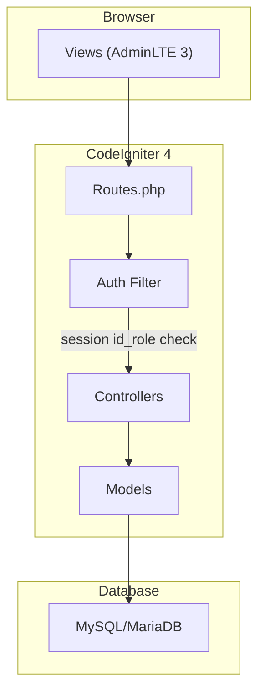
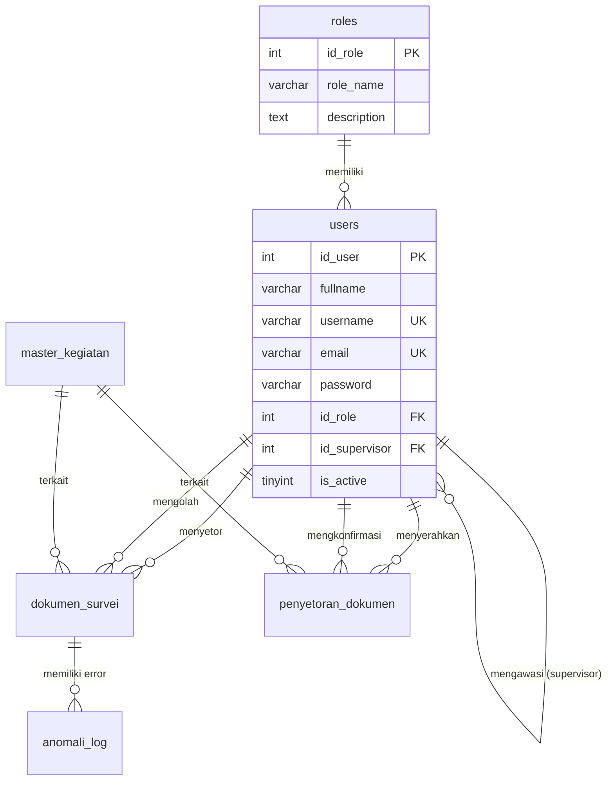
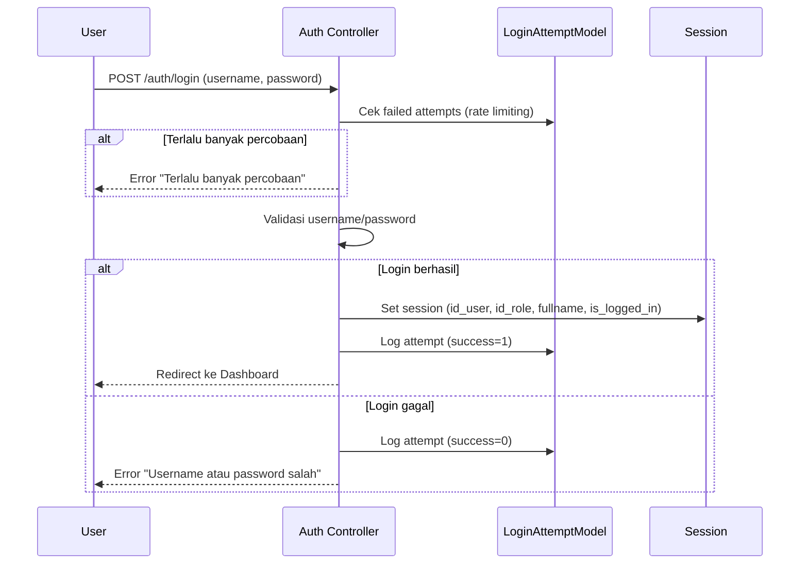

# Dokumentasi Teknis Pengembangan — MONIKA

> **Terakhir diperbarui**: 17 Februari 2026

---

## 1. Arsitektur Sistem



---

## 2. Struktur Database RBAC

### 2.1 Entity Relationship Diagram



### 2.2 Tabel-Tabel Utama

| Tabel | Deskripsi | PK | FK ke users |
|-------|-----------|-----|------------|
| `roles` | Definisi role | `id_role` | — |
| `users` | Data pengguna | `id_user` | `id_role`, `id_supervisor` |
| `user_audit_log` | Audit trail perubahan user | `id` | `changed_by` |
| `login_attempts` | Log percobaan login | `id` | — |
| `master_kegiatan` | Master kegiatan survei | `id_kegiatan` | — |
| `nks_master` | Master NKS (wilayah sampel) | `nks` | — |
| `dokumen_survei` | Dokumen yang disetor PCL | `id_dokumen` | `id_petugas_pendataan`, `processed_by` |
| `anomali_log` | Log error/anomali dokumen | `id_anomali` | `id_petugas_pengolahan` |
| `tanda_terima` | Tanda terima fisik dokumen | `id` | — |
| `kartu_kendali` | Progress entry per ruta | `id` | `user_id` |
| `presensi` | Absensi petugas | `id` | `user_id` |
| `uji_petik` | Hasil uji petik kualitas | `id` | — |
| `logistik` | Inventaris barang | `id` | — |
| `penyetoran_dokumen` | Header penyetoran ke PLS | `id_penyetoran` | `id_penyerah`, `id_penerima` |
| `penyetoran_dokumen_detail` | Detail per ruta penyetoran | `id_detail` | — |

---

## 3. Mekanisme Autentikasi

### 3.1 Login Flow



### 3.2 Session Data

```php
// Setelah login berhasil, session berisi:
session()->set([
    'id_user'      => $user['id_user'],
    'id_role'      => $user['id_role'],
    'username'     => $user['username'],
    'fullname'     => $user['fullname'],
    'email'        => $user['email'],
    'is_logged_in' => true,
]);
```

### 3.3 Auth Filter

File: `app/Filters/AuthFilter.php`

```php
// Filter ini memeriksa apakah user sudah login
// Diterapkan pada semua route kecuali login/register
if (!session()->get('is_logged_in')) {
    return redirect()->to('/login');
}
```

---

## 4. Mekanisme Otorisasi (RBAC)

### 4.1 Pattern 1: Admin Only

```php
// Di controller — hanya Admin (role 1)
public function index()
{
    if (session()->get('id_role') != 1) {
        return redirect()->to('/dashboard');
    }
    // ... logika admin
}
```

**Digunakan pada**: `UserManagement`, `Kegiatan`, `Laporan`, `Monitoring`

### 4.2 Pattern 2: Multi-Role Access

```php
// Di controller — Admin + PCL (role 1, 3)
if (!in_array((int) session()->get('id_role'), [1, 3])) {
    return redirect()->to('/dokumen');
}
```

**Digunakan pada**: `Dokumen::create`, `Dokumen::store`, `PenyetoranDokumen::create`

### 4.3 Pattern 3: Helper Method (Recommended)

```php
// Best practice: deklarasi method helper di controller
private function canCreate(): bool
{
    return in_array((int) session()->get('id_role'), [1, 3]);
}

private function canConfirm(): bool
{
    return in_array((int) session()->get('id_role'), [1, 4]);
}
```

**Digunakan pada**: `PenyetoranDokumen`

### 4.4 Pattern 4: View-Level Gating

```php
// Di view — tampilkan tombol hanya untuk role tertentu
<?php if (in_array((int) $role_id, [1, 4], true)): ?>
    <button class="btn btn-primary">Entry</button>
<?php endif; ?>
```

---

## 5. API Endpoints

### 5.1 Autentikasi

| Method | Endpoint | Deskripsi | Auth |
|--------|----------|-----------|------|
| GET | `/login` | Halaman login | — |
| POST | `/auth/login` | Proses login | CSRF |
| GET/POST | `/logout` | Proses logout | Auth |
| GET | `/register` | Halaman registrasi | — |
| POST | `/register` | Proses registrasi | CSRF |

### 5.2 User Management (Admin Only)

| Method | Endpoint | Deskripsi |
|--------|----------|-----------|
| GET | `/users` | Daftar pengguna |
| POST | `/users/store` | Tambah pengguna |
| POST | `/users/update/{id}` | Edit pengguna |
| POST | `/users/reset-password/{id}` | Reset password |
| POST | `/users/toggle-active/{id}` | Aktif/nonaktifkan |
| POST | `/users/delete/{id}` | Hapus pengguna |

### 5.3 Dokumen (Role 1, 3, 4)

| Method | Endpoint | Deskripsi | Roles |
|--------|----------|-----------|-------|
| GET | `/dokumen` | Daftar dokumen | All |
| GET | `/dokumen/create` | Form setor | 1, 3 |
| POST | `/dokumen/store` | Simpan dokumen | 1, 3 |
| POST | `/dokumen/mark-entry/{id}` | Tandai entry | 1, 4 |
| POST | `/dokumen/report-error` | Laporkan error | 1, 4 |
| GET | `/dokumen/download-template` | Template Excel | All |
| POST | `/dokumen/import-preview` | Preview impor | 1, 3 |
| POST | `/dokumen/import-store` | Simpan impor | 1, 3 |

### 5.4 Penyetoran (Role 1, 3, 4)

| Method | Endpoint | Deskripsi | Roles |
|--------|----------|-----------|-------|
| GET | `/penyetoran` | Daftar penyetoran | All |
| GET | `/penyetoran/create` | Form setor | 1, 3 |
| POST | `/penyetoran/store` | Simpan penyetoran | 1, 3 |
| GET | `/penyetoran/detail/{id}` | Lihat detail | All |
| POST | `/penyetoran/confirm/{id}` | Konfirmasi PLS | 1, 4 |
| GET | `/penyetoran/download-template` | Template Excel | All |
| POST | `/penyetoran/import-preview` | Preview impor | 1, 3 |

### 5.5 Modul Lainnya

| Grup | Base URL | Method |
|------|----------|--------|
| Kegiatan | `/kegiatan` | CRUD (Admin only) |
| Tanda Terima | `/tanda-terima` | CRUD |
| Kartu Kendali | `/kartu-kendali` | Read + Store + Delete |
| Presensi | `/presensi` | Read + Submit |
| Uji Petik | `/uji-petik` | CRUD |
| Laporan | `/laporan` | Read + Export (Admin only) |
| Logistik | `/logistik` | Read |

---

## 6. Contoh Implementasi Lengkap

### 6.1 Menambah Fitur Baru dengan Role Check

```php
// Controller: app/Controllers/FiturBaru.php
namespace App\Controllers;

class FiturBaru extends BaseController
{
    // 1. Definisikan role yang boleh akses
    private function canManage(): bool
    {
        return in_array((int) session()->get('id_role'), [1, 5]); // Admin + PML
    }

    // 2. Terapkan di setiap method
    public function index()
    {
        // Semua role bisa lihat
        $data = ['title' => 'Fitur Baru'];
        return view('fiturbaru/index', $data);
    }

    public function create()
    {
        // Hanya role tertentu
        if (!$this->canManage()) {
            return redirect()->to('/fiturbaru')->with('error', 'Akses ditolak.');
        }
        return view('fiturbaru/create');
    }
}
```

```php
// View: tampilkan tombol sesuai role
<?php $role = (int) session()->get('id_role'); ?>
<?php if (in_array($role, [1, 5], true)): ?>
    <a href="/fiturbaru/create" class="btn btn-primary">Tambah</a>
<?php endif; ?>
```

```php
// Route: app/Config/Routes.php
$routes->group('fiturbaru', static function ($routes): void {
    $routes->get('/', 'FiturBaru::index');
    $routes->get('create', 'FiturBaru::create');
    $routes->post('store', 'FiturBaru::store', ['filter' => 'csrf']);
});
```
